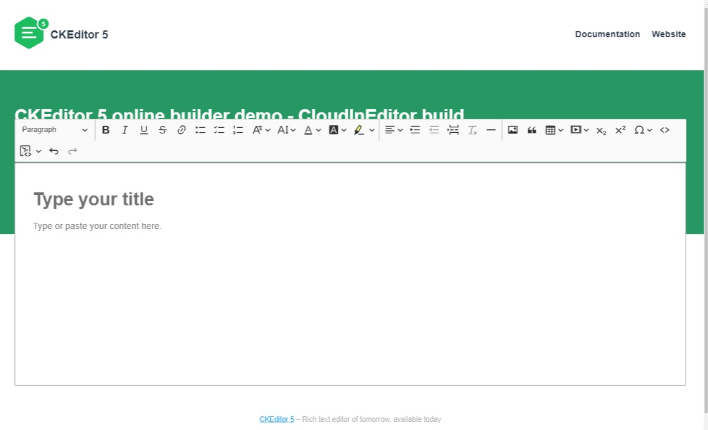

# CKEditor5 - CloudInEditor Build initialized with the online builder

This repository presents a CKEditor 5 editor build generated by the [Online builder tool](https://ckeditor.com/ckeditor-5/online-builder)



## Usage

Clone the source from github:

```
npm install ckeditor5-build-cloudin

```

In your component do:

```
import CloudInEditor from "ckeditor5-build-cloudin";

```

Add your custom or additional plugins to `extraPlugins: [...myPlugins]` of the editorConfig,

## Quick start

1. Set the style for toolbar item wrapping

```
   .ck.ck-toolbar.ck-toolbar_floating > .ck-toolbar\_\_items {
      flex-wrap: wrap !important;
      width: 93vw; // you can define width same size as the textarea width
   }

```

2. Open the `sample/index.html` page in the browser using a live server.

## Configuring build

Changes like changing toolbar items, changing order of icons or customizing plugin configurations should be relatively easy to make. Open the `sample/index.html` file and edit the script that initialized the CKEditor 5. Save the file and refresh the browser. That's all.

_Note:_ If you have any problems with browser caching use the `Ctrl + R` or `Cmd + R` shortcut depending on your system.

However if you want to remove or add a plugin to the build you need to follow the next step of this guide.

Note that it is also possible to go back to the [Online builder tool](https://ckeditor.com/ckeditor-5/online-builder) and pick other set of plugins. But we encourage you to try the harder way and to learn the principles of Node.js and CKEditor 5 ecosystems that will allow you to do more cool things in the future!

### Installation

In order to rebuild the application you need to install all dependencies first. To do it, open the terminal in the project directory and type:

```
npm install
```

Make sure that you have the `node` and `npm` installed first. If not, then follow the instructions on the [Node.js documentation page](https://nodejs.org/en/).

### Adding or removing plugins

Now you can install additional plugin in the build. Just follow the [Adding a plugin to an editor tutorial](https://ckeditor.com/docs/ckeditor5/latest/builds/guides/integration/installing-plugins.html#adding-a-plugin-to-an-editor)

### Rebuilding editor

If you have already done the [Installation](#installation) and [Adding or removing plugins](#adding-or-removing-plugins) steps, you're ready to rebuild the editor by running the following command:

```
npm run build
```

This will build the CKEditor5-build-cloudInEditor to the `build` directory. You can open your browser and you should be able to see the changes you've made in the code. If not, then try to refresh also the browser cache by typing `Ctrl + R` or `Cmd + R` depending on your system.

## What's next?

Follow the guides available on https://ckeditor.com/docs/ckeditor5/latest/framework/index.html and enjoy the document editing.

## FAQ

| Where is the place to report bugs and feature requests?

You can create an issue on https://github.com/ckeditor/ckeditor5/issues. Make sure that the question / problem is unique, please look for a possibly asked questions in the search box. Duplicates will be closed.

| Where can I learn more about the CKEditor 5 framework?

Here: https://ckeditor.com/docs/ckeditor5/latest/framework/
